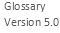

Glossary

**Project title:** European Federation for Cancer Images

**Project acronym:** EUCAIM

**Grant Agreement:** 101100633

**Call identifier:** DIGITAL-2022-CLOUD-AI-02

**EUCAIM Glossary: Commonly Used Terms in the Field of Health Data Research**
# Glossary Team

- Irene Marín Radoszynski (HULAFE) <irene_marin@iislafe.es>
- Carina Soler Pons (HULAFE) <carina_soler@iislafe.es>
- Ana García Marco <ana_garcia_marco@iislafe.es>
- Patricia Serrano Candelas <patricia_serrano@iislafe.es> 
- Leonor Cerdá Alberich (HULAFE) <leonor_cerda@iislafe.es>
- Luis Marti-Bonmati (HULAFE) <luis_marti@iislafe.es>
- Ignacio Blanquer (UPV) <iblanque@dsic.upv.es> 
- Hanna Leisz (DKFZ) <hanna.leisz@dkfz-heidelberg.de>
- Ricard Martinez (UV) (<ricard.martinez@uv.es>) 
- Janos Meszaros (KUL) <janos.meszaros@kuleuven.be> 
- Sara Zullino (EATRIS) <sarazullino@eatris.eu> 
- Esther Bron (Erasmus MC / Health-RI) <e.bron@erasmusmc.nl> 
- Carles Hernandez-Ferrer (BSC) [carles.](mailto:carles.hernandez2@bsc.es)[hernandez2](mailto:carles.hernandez2@bsc.es)[@bsc.es](mailto:carles.hernandez2@bsc.es)
- Laura Portell (BSC) <laura.portell@bsc.es>
- Katrine Riklund (UMU) <katrine.riklund@umu.se>
- Valia Kalokyri (FORTH) [vkalokyri@](mailto:vkalokyri@gmail.com)[ics.forth.gr](mailto:vkalokyri@gmail.com)

#
# Introduction
The aim of this glossary is to establish agreed definitions of commonly used terms to harmonise the understandings and works of the project. This living document will be updated regularly with the addition of new terms and modifications of the definitions, if needed. 

This glossary was created by the EUCAIM consortium partners, based on the European project HealthyCloud glossary. When possible, terms are aligned with the Proposal for a Regulation on the European Health Data Space (EHDS).

